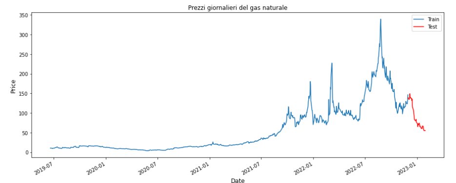
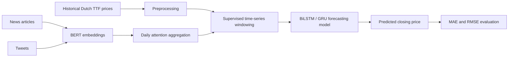
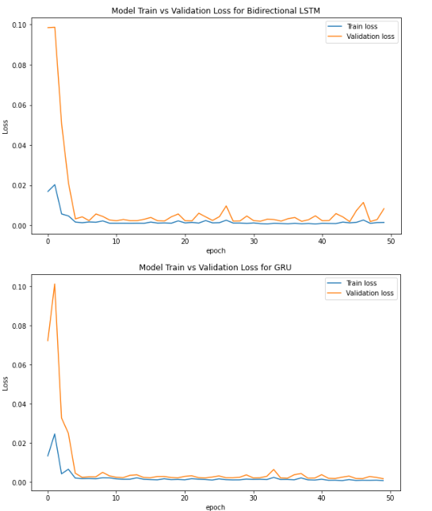
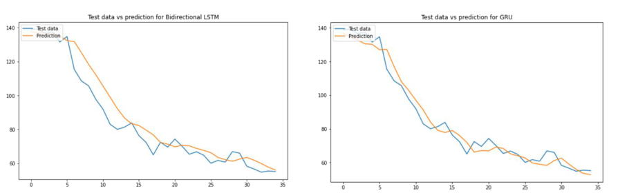

# Dutch TTF Price Forecasting with News and Tweet Embeddings


This project investigates whether **textual information from news articles and tweets** can improve short-term forecasting of the Dutch TTF natural gas price index.

The forecasting pipeline combines historical market data with BERT-based textual embeddings. Daily textual features are obtained through an attention mechanism and then fused with the time series before training recurrent neural networks. The final models are compared against a Prophet baseline.

<p align="center">
  
</p>

<p align="center">
  <em>Figure 1. Dutch TTF daily natural gas price series and train/test split used for forecasting.</em>
</p>

The experimental evidence shows that recurrent neural networks significantly outperform the Prophet baseline. However, adding textual embeddings from news and tweets does not produce a consistent improvement over using the historical price series alone.

---

## 1. Problem statement

The European energy crisis and the geopolitical instability related to the Russia-Ukraine conflict increased the volatility of natural gas prices. This makes short-term forecasting of the Dutch TTF index a difficult time-series prediction problem.

The main research question is:

> Can textual signals extracted from news articles and tweets improve the short-term prediction of Dutch TTF natural gas prices?

The project evaluates this question by comparing:

- a baseline forecasting model based on Prophet;
- recurrent neural networks trained only on historical prices;
- recurrent neural networks trained on market features;
- recurrent neural networks enriched with BERT-based news embeddings;
- recurrent neural networks enriched with BERT-based tweet embeddings.

---

## 2. Data sources

### Dutch TTF price series

The historical market dataset contains daily Dutch TTF gas price data downloaded from Yahoo Finance.

| Feature | Meaning |
|---|---|
| `Date` | Trading date |
| `Open` | Opening price |
| `High` | Maximum daily price |
| `Low` | Minimum daily price |
| `Close` | Closing price used as forecasting target |
| `Volume` | Daily traded volume |

The dataset covers the period from:

```text
2019-06-19 to 2023-01-30
```

The target variable is:

```text
Close
```

Missing market-closure days, such as weekends, are not synthetically inserted.

### News data

News articles were scraped from **OilPrice.com**, focusing on:

- `Energy / Natural Gas`;
- `Geopolitics / Europe`.

The scraping process also follows related article links where available. The collected text is cleaned by removing links, advertisements and HTML fragments, and then stored with the publication date.

### Tweet data

Tweets were collected through the Twitter API v2 full-archive endpoint using energy-related keywords and hashtags.

The query focuses on English-language tweets related to:

```text
#gas, #gasprice, #oilgas, #naturalgas, #energy
```

Tweets are cleaned by removing mentions, links, emojis, phone numbers and other noisy tokens before being stored with their publication date.

---

## 3. Forecasting pipeline

The project implements the following end-to-end workflow.



Main processing stages:

1. load and clean Dutch TTF historical price data;
2. load textual data from news articles or tweets;
3. compute BERT-based text embeddings;
4. aggregate same-day text embeddings through an attention mechanism;
5. merge market features and daily textual features;
6. reformulate the time series as a supervised learning problem;
7. train BiLSTM or GRU neural networks;
8. evaluate predictions using MAE and RMSE.

---

## 4. Text representation

### BERT embedding model

Textual features are extracted using **BERT-Base Uncased** from Hugging Face.

The preprocessing strategy is:

| Source | Text selection strategy |
|---|---|
| Tweets | Full tweet text |
| News articles | First 200 words and last 200 words |

The text is tokenized, padded to a maximum length of 512 tokens and processed through BERT. The output associated with the `[CLS]` token is used as the sentence/document-level representation.

### Daily attention aggregation

Multiple texts can be associated with the same date. For this reason, embeddings are grouped by day and converted into a single daily textual feature vector using an attention mechanism.

Given daily embeddings, the mechanism computes Query, Key and Value matrices and applies a softmax-normalized similarity score:

```math
Attention_d = \sum_{i=1}^{n}\left(softmax\left(\frac{cosine(K_i, Q_i)}{\sqrt{768}}\right) \cdot V_i\right)
```

The resulting daily attention vector is merged with the time-series features before training the forecasting model.

---

## 5. Forecasting models

Two recurrent neural network architectures are evaluated.

### BiLSTM

The Bidirectional LSTM model processes the input sequence in both temporal directions. This allows the network to exploit forward and backward dependencies inside the lookback window.

Architecture summary:

| Layer | Configuration |
|---|---|
| Recurrent layer 1 | 100 neurons |
| Dropout 1 | 20% |
| Recurrent layer 2 | 50 neurons |
| Dropout 2 | 25% |
| Output layer | Dense layer with 1 neuron |

### GRU

The GRU model is a recurrent architecture with a simpler gating mechanism than LSTM. It uses update and reset gates to control memory propagation across time steps.

Architecture summary:

| Layer | Configuration |
|---|---|
| Recurrent layer 1 | 100 neurons |
| Dropout 1 | 20% |
| Recurrent layer 2 | 50 neurons |
| Dropout 2 | 25% |
| Output layer | Dense layer with 1 neuron |

---

## 6. Experimental setup

The dataset is split as follows:

| Split | Date range | Observations |
|---|---|---:|
| Training set | `2019-06-19` to `2022-11-30` | 872 |
| Test set | `2022-12-01` to `2023-01-31` | 40 |

The forecasting problem is reformulated as supervised learning using a lookback window of 5 days:

```text
Input  = features from the previous 5 days
Output = Dutch TTF closing price on the next day
```

Model training configuration:

| Parameter | Value |
|---|---:|
| Epochs | 50 |
| Batch size | 64 |
| Validation split | 20% of the training set |
| Scaling | Min-Max normalization in [0, 1] |
| Evaluation metrics | MAE, RMSE |

Evaluated feature configurations:

| Configuration | Included information |
|---|---|
| Univariate | Closing price only |
| Multivariate with market features | Close, Open, High, Low, Volume |
| Multivariate with datetime features | Close plus engineered date features |
| Multivariate with news embeddings | Close plus news attention features |
| Multivariate with tweet embeddings | Close plus tweet attention features |

---

## 7. Results

The learning curves show that both recurrent models converge quickly and do not show evident overfitting after the first epochs.

<p align="center">
  
</p>

<p align="center">
  <em>Figure 2. Training and validation loss curves for BiLSTM and GRU models.</em>
</p>

### Quantitative comparison

| Model / configuration | BiLSTM MAE | BiLSTM RMSE | GRU MAE | GRU RMSE |
|---|---:|---:|---:|---:|
| Prophet baseline | 71.4165 | 74.8558 | 71.4165 | 74.8558 |
| Univariate | 5.6700 | 7.6069 | **4.2199** | **4.9942** |
| Multivariate with market features | 7.4843 | 9.0948 | 8.6714 | 10.1310 |
| Multivariate with datetime features | 8.2699 | 10.0228 | 8.5123 | 10.6952 |
| Multivariate with news embeddings | 6.3099 | 7.3194 | 9.2775 | 10.6952 |
| Multivariate with tweet embeddings | 5.4210 | 7.7884 | 7.1052 | 9.1566 |

The best overall result is achieved by the **GRU univariate model**, with:

```text
MAE  = 4.2199
RMSE = 4.9942
```

The results indicate that recurrent neural networks model the short-term price dynamics much better than the Prophet baseline. At the same time, the addition of textual embeddings does not consistently improve the forecasting performance.

<p align="center">
  
</p>

<p align="center">
  <em>Figure 3. Comparison between predicted and real test values for BiLSTM and GRU.</em>
</p>

---

## 8. Discussion

The experiments lead to three main observations.

First, both BiLSTM and GRU strongly outperform Prophet on the test interval, reducing the forecasting error by a large margin.

Second, using additional market or calendar features does not necessarily improve performance. In this dataset, the univariate formulation is the most effective configuration for GRU.

Third, textual embeddings from news and tweets do not provide a clear benefit. This may be due to the limited size of the text corpus, the difficulty of aligning publication dates with market reactions, or the fact that generic BERT embeddings are not optimized for financial or energy-market sentiment extraction.

From an engineering perspective, the most reliable configuration is therefore the simplest one: a recurrent model trained on the historical closing-price sequence.

---

## 9. Repository structure

```text
.
├── ScrapingOilPrice/
│   ├── function/
│   └── news_scraper.py
│
├── ScrapingTweet/
│   ├── function/
│   ├── json_file/
│   ├── json_result/
│   └── twitter_scraper.py
│
├── assets/
│   ├── ttf_train_test_split.png
│   ├── training_validation_loss.png
│   └── prediction_vs_real.png
│
├── data/
│   ├── all_news.csv
│   ├── gas_news.csv
│   ├── gas_prices.csv
│   ├── geopolitcs_news.csv
│   └── twitter.csv
│
├── models/
│   ├── BERT.py
│   └── networks.py
│
├── notebooks/
│   ├── BERT.ipynb
│   ├── BiLSTM_& _GRU.ipynb
│   └── Prophet.ipynb
│
├── output/
│   └── predictions.csv
│
├── reports/
│   └── Relazione_AIML_Abbaticchio_Battista_Catucci.pdf
│
├── utils/
│   └── preprocessing_commons.py
│
├── config.py
├── main.py
├── requirements.txt
└── README.md
```

---

## 10. Configuration

The main experiment settings are defined in `config.py`.

```python
twitter_api_token = ''
source = 'news'
text_directory = './data/'
dataset_path = './data/gas_prices.csv'
nn = 'BiLSTM'
univariate = False
```

### Text source

Use news articles:

```python
source = 'news'
```

Use tweets:

```python
source = 'twitter'
```

### Neural model

Use BiLSTM:

```python
nn = 'BiLSTM'
```

Use GRU:

```python
nn = 'GRU'
```

### Univariate mode

Use only the historical closing-price sequence:

```python
univariate = True
```

Use textual or additional features:

```python
univariate = False
```

### Twitter API token

Local tweet files can be processed without performing new API calls. To collect new tweets, insert a valid Twitter API v2 Bearer Token:

```python
twitter_api_token = 'YOUR_TOKEN_HERE'
```

Do not commit real API tokens to version control.

---

## 11. Installation

Create and activate a virtual environment:

```bash
python -m venv venv
```

On Windows:

```bash
venv\Scripts\activate
```

On Linux/macOS:

```bash
source venv/bin/activate
```

Install the required dependencies:

```bash
pip install -r requirements.txt
```

Depending on the local Python version, GPU support and operating system, TensorFlow, PyTorch or Prophet may require additional installation steps.

---

## 12. Usage

Run the main script:

```bash
python main.py
```

The script performs the complete forecasting pipeline:

1. load the Dutch TTF historical price dataset;
2. preprocess and normalize the time series;
3. load either news or tweet data;
4. compute BERT-based textual embeddings;
5. aggregate daily textual information;
6. train the selected neural network;
7. evaluate predictions using MAE and RMSE;
8. export the predicted values.

The output predictions are saved in:

```text
output/predictions.csv
```

---

## 13. Notebooks

The `notebooks/` directory contains the experimental notebooks used during the project.

| Notebook | Purpose |
|---|---|
| `Prophet.ipynb` | Baseline forecasting model |
| `BERT.ipynb` | Textual embedding extraction |
| `BiLSTM_& _GRU.ipynb` | Recurrent neural network experiments |

---

## 15. Future work

Possible extensions include:

- using domain-specific language models for finance or energy markets;
- replacing generic embeddings with sentiment-aware features;
- increasing the number and diversity of textual sources;
- introducing publication-lag features to better align text with price movements;
- evaluating transformer-based time-series models;
- performing ablation studies on the attention aggregation mechanism;
- extending the prediction horizon beyond one day.

---

## Authors

- Michele Abbaticchio
- Stefano Battista
- Domenico Catucci

---

## Academic context

Project work for the Artificial Intelligence and Machine Learning course, A.Y. 2021/2022.

Politecnico di Bari.

Professors:

- Prof. Tommaso Di Noia
- Prof. Vito Walter Anelli

---

## License

This repository is intended for academic and portfolio purposes.
